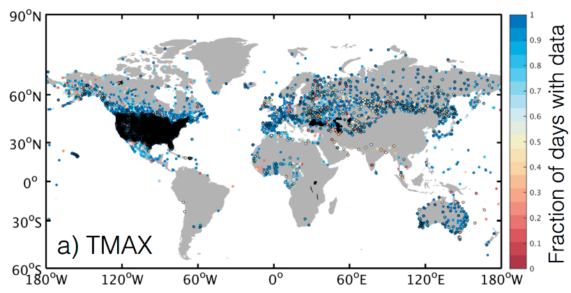

# Getting-Climate-Data-for-Specific-Locations
Getting climate data from NOAA's Global Historical Climatology Network (GHCN)  and preparing it for machine learning.

NOAA's Global Historical Climatology Network (GHCN) is a database that contains global surface temperature data, as well as precipitation and other weather-related variables from meteorological stations around the world. It is one of the most widely used sources of climate data and is maintained by the National Oceanic and Atmospheric Administration (NOAA) in the United States.

The GHCN database includes data from over 25,000 weather stations in 180 countries, with some records dating back to the mid-19th century. The data is collected from a variety of sources, including national meteorological agencies, universities, and research institutions.

The GHCN database is widely used for climate research, including the study of long-term climate trends and variability, climate modeling, and the assessment of climate impacts on human and natural systems. It is also used to produce global temperature records, such as the NOAA Global Temperature Report, which provides an authoritative assessment of global temperature trends over time.
